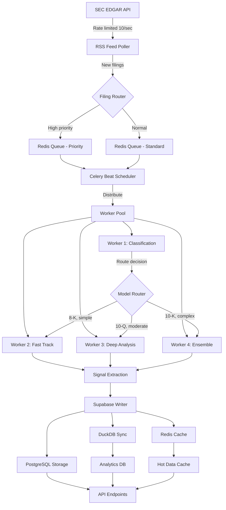

# Data Pipeline Architecture
**SEC Filing Analysis System - End-to-End Data Flow**

## Executive Summary

This document defines the complete data pipeline for SEC filing analysis, supporting:
- **Throughput**: 100+ filings/hour (peak), 50+ filings/hour (sustained)
- **Latency**: Sub-40s end-to-end processing (10-K), sub-10s (8-K)
- **Reliability**: 99.9% uptime, automatic retry/recovery
- **Scalability**: Horizontal scaling to 10 parallel workers
- **Cost Efficiency**: 93% savings vs. cloud AI APIs

---

## 1. ARCHITECTURE OVERVIEW

### 1.1 High-Level Pipeline

```
┌─────────────────────────────────────────────────────────────────────┐
│                         INGESTION LAYER                              │
│  ┌──────────────┐     ┌──────────────┐     ┌──────────────┐        │
│  │ SEC EDGAR    │────▶│ RSS Feed     │────▶│ Filing Queue │        │
│  │ Connector    │     │ Poller       │     │ (Redis)      │        │
│  └──────────────┘     └──────────────┘     └──────────────┘        │
└─────────────────────────────────────────────────────────────────────┘
                                 │
                                 ▼
┌─────────────────────────────────────────────────────────────────────┐
│                       PROCESSING LAYER                               │
│  ┌──────────────────────────────────────────────────────────────┐  │
│  │         Celery Workers (4-10 parallel streams)               │  │
│  │  ┌──────────┐  ┌──────────┐  ┌──────────┐  ┌──────────┐   │  │
│  │  │Worker 1  │  │Worker 2  │  │Worker 3  │  │Worker 4  │   │  │
│  │  │(Tier 1)  │  │(Tier 2A) │  │(Tier 2B) │  │(Tier 2C) │   │  │
│  │  └──────────┘  └──────────┘  └──────────┘  └──────────┘   │  │
│  └──────────────────────────────────────────────────────────────┘  │
└─────────────────────────────────────────────────────────────────────┘
                                 │
                                 ▼
┌─────────────────────────────────────────────────────────────────────┐
│                         STORAGE LAYER                                │
│  ┌──────────────┐  ┌──────────────┐  ┌──────────────┐             │
│  │  Supabase    │  │   DuckDB     │  │    Redis     │             │
│  │ (Persistent) │  │ (Analytics)  │  │  (Caching)   │             │
│  └──────────────┘  └──────────────┘  └──────────────┘             │
└─────────────────────────────────────────────────────────────────────┘
                                 │
                                 ▼
┌─────────────────────────────────────────────────────────────────────┐
│                         ANALYTICS LAYER                              │
│  ┌──────────────┐  ┌──────────────┐  ┌──────────────┐             │
│  │   Signal     │  │   Trend      │  │   Network    │             │
│  │ Aggregation  │  │  Analysis    │  │   Analysis   │             │
│  └──────────────┘  └──────────────┘  └──────────────┘             │
└─────────────────────────────────────────────────────────────────────┘
```

### 1.2 Component Interaction Diagram



---

## 2. INGESTION LAYER

### 2.1 SEC EDGAR Connector

**Purpose**: Fetch new filings from SEC EDGAR API with rate limiting and error handling.

```python
# Async connector with rate limiting
class SECEdgarConnector:
    def __init__(self):
        self.rate_limiter = RateLimiter(max_requests=10, period=1.0)
        self.session = aiohttp.ClientSession()

    async def poll_rss_feed(self) -> List[Filing]:
        """
        Poll SEC RSS feed for new filings
        Target: 10 requests/second, 600 filings/minute discovery rate
        """
        feed_url = "https://www.sec.gov/cgi-bin/browse-edgar?action=getcurrent"
        async with self.rate_limiter:
            response = await self.session.get(feed_url)
            filings = self.parse_rss(await response.text())
        return filings

    async def fetch_filing_content(self, url: str) -> str:
        """
        Fetch full filing document
        Target: <2s per filing
        """
        async with self.rate_limiter:
            response = await self.session.get(url)
            return await response.text()
```

**Performance Targets**:
- RSS feed polling: Every 60 seconds
- Filing discovery latency: <1 minute from SEC publication
- Content fetch: <2s per document
- Error retry: 3 attempts with exponential backoff

### 2.2 Filing Queue Management

**Redis Queue Structure**:

```python
# Queue priorities
QUEUE_PRIORITIES = {
    "critical": 1,    # 8-K material events, Form 4 insider trading
    "high": 3,        # 10-Q quarterly reports
    "normal": 5,      # 10-K annual reports
    "low": 7,         # Amendments, registration statements
}

# Queue implementation
class FilingQueue:
    def __init__(self, redis_client):
        self.redis = redis_client

    def enqueue(self, filing: Filing, priority: int = 5):
        """Add filing to processing queue"""
        queue_key = f"queue:priority:{priority}"
        filing_data = filing.to_json()

        # Add to priority queue (sorted set by timestamp)
        score = time.time()
        self.redis.zadd(queue_key, {filing_data: score})

        # Add to lookup index
        self.redis.hset(f"filing:{filing.accession_number}",
                        "status", "queued",
                        "queued_at", score)

    def dequeue(self, priority_levels: List[int]) -> Optional[Filing]:
        """Get next filing from highest priority queue"""
        for priority in sorted(priority_levels):
            queue_key = f"queue:priority:{priority}"
            result = self.redis.zpopmin(queue_key)
            if result:
                filing_data, score = result[0]
                return Filing.from_json(filing_data)
        return None
```

**Queue Metrics**:
- Max queue depth: 500 filings
- Target dequeue rate: 50+ filings/minute
- Max wait time (P95): 2 minutes at peak load

---

## 3. PROCESSING LAYER

### 3.1 Celery Worker Architecture

**Worker Pool Configuration**:

```python
# Celery configuration
CELERY_CONFIG = {
    "broker_url": "redis://localhost:6379/0",
    "result_backend": "redis://localhost:6379/0",
    "task_serializer": "json",
    "result_serializer": "json",
    "worker_concurrency": 4,  # Per worker process
    "worker_prefetch_multiplier": 2,
    "task_default_rate_limit": "100/m",
}

# Worker specialization
WORKER_ROLES = {
    "worker1": ["classification", "signal_extraction"],
    "worker2": ["fast_track_analysis"],
    "worker3": ["deep_analysis"],
    "worker4": ["ensemble_consensus"],
}
```

### 3.2 Processing Stages

#### Stage 1: Classification (Phi3 - Tier 1)

```python
@celery_app.task(name="classify_filing", time_limit=3, soft_time_limit=2)
def classify_filing(filing_id: str) -> dict:
    """
    Classify filing and determine processing route
    Target: <2s (P95), <1.5s timeout
    """
    filing = fetch_filing(filing_id)

    # Phi3 classification
    classifier = ModelRouter.get_classifier()
    classification = classifier.predict({
        "form_type": filing.form_type,
        "document_length": len(filing.content),
        "first_500_chars": filing.content[:500]
    })

    return {
        "filing_id": filing_id,
        "complexity": classification.complexity_score,
        "materiality": classification.materiality_score,
        "recommended_tier": classification.route,
        "confidence": classification.confidence
    }
```

#### Stage 2: Signal Extraction

```python
@celery_app.task(name="extract_signals", time_limit=15)
def extract_signals(filing_id: str) -> dict:
    """
    Extract 150 latent signals from filing
    Target: <10s for 10-K, <5s for 10-Q
    """
    filing = fetch_filing(filing_id)
    parsed = parse_filing_sections(filing.content)

    # Parallel signal extraction
    with concurrent.futures.ThreadPoolExecutor(max_workers=5) as executor:
        futures = {
            executor.submit(extract_linguistic_signals, parsed): "linguistic",
            executor.submit(extract_structural_signals, parsed): "structural",
            executor.submit(extract_network_signals, parsed): "network",
            executor.submit(extract_temporal_signals, parsed): "temporal",
            executor.submit(extract_visual_signals, parsed): "visual",
        }

        signals = {}
        for future in concurrent.futures.as_completed(futures):
            dimension = futures[future]
            signals[dimension] = future.result()

    return {
        "filing_id": filing_id,
        "signals": signals,
        "signal_count": sum(len(s) for s in signals.values())
    }
```

#### Stage 3: AI Analysis (Model-Specific)

```python
@celery_app.task(name="analyze_filing", time_limit=50)
def analyze_filing(filing_id: str, model_tier: str) -> dict:
    """
    Deep AI analysis using appropriate model tier
    Target: <40s (10-K), <10s (8-K)
    """
    filing = fetch_filing(filing_id)
    signals = fetch_signals(filing_id)

    # Route to appropriate model
    if model_tier == "tier2a":
        model = Mistral7B()
        result = model.analyze_fast(filing, signals)
    elif model_tier == "tier2b":
        model = DeepSeekR1()
        result = model.analyze_deep(filing, signals)
    elif model_tier == "tier2c":
        ensemble = EnsembleConsensus()
        result = ensemble.analyze_consensus(filing, signals)

    return {
        "filing_id": filing_id,
        "analysis": result.summary,
        "confidence": result.confidence,
        "duration_ms": result.processing_time
    }
```

### 3.3 Error Handling & Retry Logic

```python
# Retry configuration
RETRY_CONFIG = {
    "max_retries": 3,
    "retry_backoff": True,
    "retry_backoff_max": 600,  # 10 minutes
    "retry_jitter": True,
}

@celery_app.task(bind=True, **RETRY_CONFIG)
def resilient_task(self, filing_id: str):
    try:
        result = process_filing(filing_id)
        return result
    except TemporaryError as exc:
        # Retry on temporary failures
        raise self.retry(exc=exc, countdown=2 ** self.request.retries)
    except PermanentError as exc:
        # Log and fail permanently
        logger.error(f"Permanent failure for {filing_id}: {exc}")
        mark_filing_failed(filing_id, str(exc))
        return {"status": "failed", "error": str(exc)}
```

### 3.4 Parallel Processing Strategy

**Stream Allocation**:

```
Worker 1 (Classification)
├─ Queue: All new filings
├─ Concurrency: 50 concurrent classifications
└─ Output: Routing decisions → Other workers

Worker 2 (Fast Track - Mistral 7B)
├─ Queue: 8-K, simple 10-Q
├─ Concurrency: 3 concurrent analyses
└─ Target: 12 filings/minute

Worker 3 (Deep Analysis - DeepSeek-R1)
├─ Queue: 10-K, complex 10-Q
├─ Concurrency: 2 concurrent analyses
└─ Target: 3-4 filings/minute

Worker 4 (Ensemble)
├─ Queue: High materiality filings
├─ Concurrency: 2 concurrent analyses
└─ Target: 3-4 filings/minute
```

**Load Balancing Algorithm**:

```python
def allocate_worker(classification: dict) -> str:
    """Dynamic worker allocation based on load and classification"""
    complexity = classification["complexity"]
    materiality = classification["materiality"]

    # Check current worker loads
    worker_loads = get_worker_loads()

    # Priority routing
    if materiality > 0.8:
        return "worker4"  # Ensemble for high materiality
    elif complexity < 0.4:
        return "worker2"  # Fast track for simple filings
    elif complexity > 0.7:
        return "worker3"  # Deep analysis for complex filings
    else:
        # Load balance between workers 2 and 3
        return "worker2" if worker_loads["worker2"] < worker_loads["worker3"] else "worker3"
```

---

## 4. STORAGE LAYER

### 4.1 Write Path

```python
async def store_filing_results(filing_id: str, signals: dict, analysis: dict):
    """
    Store results across all storage layers
    Target: <500ms total write latency
    """
    # Parallel writes
    async with asyncio.TaskGroup() as tg:
        # Primary storage (Supabase)
        tg.create_task(
            supabase_connector.store_filing_analysis(filing_id, signals, analysis)
        )

        # Analytics storage (DuckDB)
        tg.create_task(
            duckdb_connector.store_filing_analysis(filing_id, signals, analysis)
        )

        # Hot cache (Redis)
        tg.create_task(
            redis_cache.cache_filing(filing_id, signals, analysis, ttl=3600)
        )
```

### 4.2 Read Path (Query Optimization)

```python
class QueryOptimizer:
    def __init__(self, redis, supabase, duckdb):
        self.redis = redis
        self.supabase = supabase
        self.duckdb = duckdb

    async def get_filing_analysis(self, accession_number: str) -> dict:
        """
        Multi-tier cache lookup
        L1 (Redis): <1ms
        L2 (Supabase): <50ms
        L3 (DuckDB): <100ms
        """
        # L1: Redis cache
        cached = self.redis.get(f"filing:{accession_number}")
        if cached:
            return json.loads(cached)

        # L2: Supabase (recent data)
        result = await self.supabase.get_filing_analysis(accession_number)
        if result:
            # Cache for future requests
            self.redis.setex(f"filing:{accession_number}", 3600, json.dumps(result))
            return result

        # L3: DuckDB (historical data)
        result = self.duckdb.get_filing_analysis(accession_number)
        return result
```

### 4.3 Data Retention Policy

```python
RETENTION_POLICY = {
    # Redis (hot cache)
    "redis": {
        "recent_filings": "30 days",
        "signal_summaries": "7 days",
        "search_results": "1 hour",
    },

    # Supabase (warm storage)
    "supabase": {
        "filings": "2 years (online)",
        "signals": "2 years (online)",
        "analyses": "2 years (online)",
        "processing_metrics": "6 months",
    },

    # DuckDB (analytics)
    "duckdb": {
        "active_window": "90 days (hot)",
        "archive": "Unlimited (Parquet cold storage)",
    },
}
```

---

## 5. MONITORING & OBSERVABILITY

### 5.1 Real-Time Metrics

```python
# Prometheus metrics
from prometheus_client import Counter, Histogram, Gauge

# Throughput metrics
filings_processed = Counter(
    "filings_processed_total",
    "Total filings processed",
    ["form_type", "model_tier"]
)

# Latency metrics
processing_duration = Histogram(
    "filing_processing_duration_seconds",
    "Filing processing duration",
    ["form_type", "model_tier"],
    buckets=[1, 5, 10, 20, 40, 60, 120]
)

# Queue depth
queue_depth = Gauge(
    "processing_queue_depth",
    "Current queue depth",
    ["priority"]
)

# Error rate
processing_errors = Counter(
    "processing_errors_total",
    "Total processing errors",
    ["error_type", "stage"]
)
```

### 5.2 Health Checks

```python
@app.get("/health")
async def health_check():
    """
    System health check
    Target: <100ms response time
    """
    checks = {
        "redis": await check_redis_connection(),
        "supabase": await check_supabase_connection(),
        "duckdb": await check_duckdb_connection(),
        "sec_edgar": await check_sec_edgar_availability(),
        "worker_pool": check_celery_workers(),
    }

    healthy = all(checks.values())
    status_code = 200 if healthy else 503

    return {
        "status": "healthy" if healthy else "degraded",
        "checks": checks,
        "timestamp": datetime.utcnow().isoformat()
    }, status_code
```

### 5.3 Alerting Rules

```yaml
# Prometheus alerting rules
groups:
  - name: filing_pipeline
    interval: 30s
    rules:
      - alert: HighQueueDepth
        expr: processing_queue_depth > 300
        for: 5m
        annotations:
          summary: "Processing queue depth exceeds threshold"

      - alert: HighLatency
        expr: histogram_quantile(0.95, filing_processing_duration_seconds) > 50
        for: 10m
        annotations:
          summary: "P95 processing latency exceeds 50s"

      - alert: HighErrorRate
        expr: rate(processing_errors_total[5m]) > 0.05
        for: 5m
        annotations:
          summary: "Error rate exceeds 5%"
```

---

## 6. SCALABILITY & PERFORMANCE

### 6.1 Horizontal Scaling

```python
# Auto-scaling configuration
AUTO_SCALING_CONFIG = {
    "min_workers": 4,
    "max_workers": 10,
    "scale_up_threshold": {
        "queue_depth": 200,  # Scale up if queue > 200
        "cpu_utilization": 0.80,  # Scale up if CPU > 80%
    },
    "scale_down_threshold": {
        "queue_depth": 50,  # Scale down if queue < 50
        "cpu_utilization": 0.40,  # Scale down if CPU < 40%
    },
    "cooldown_period": 300,  # 5 minutes between scaling events
}
```

### 6.2 Performance Optimization

**Database Query Optimization**:
```sql
-- Indexed queries for sub-50ms performance
CREATE INDEX CONCURRENTLY idx_filings_accession ON filings(accession_number);
CREATE INDEX CONCURRENTLY idx_signals_filing_category ON signals(filing_id, signal_category);
CREATE INDEX CONCURRENTLY idx_filings_cik_date ON filings(cik, filing_date DESC);

-- Materialized views for common aggregations
CREATE MATERIALIZED VIEW company_signal_summaries AS
SELECT
    cik,
    COUNT(DISTINCT f.id) as filing_count,
    AVG(s.confidence) as avg_signal_confidence,
    COUNT(s.id) as total_signals
FROM filings f
JOIN signals s ON f.id = s.filing_id
GROUP BY cik;

-- Refresh strategy
REFRESH MATERIALIZED VIEW CONCURRENTLY company_signal_summaries;
```

**Cache Warming Strategy**:
```python
async def warm_cache():
    """Pre-load hot data into Redis cache"""
    # Cache recent filings (last 7 days)
    recent_filings = await supabase.query(
        "SELECT * FROM filings WHERE filing_date >= CURRENT_DATE - 7"
    )

    for filing in recent_filings:
        await redis.setex(
            f"filing:{filing['accession_number']}",
            3600,
            json.dumps(filing)
        )
```

---

## 7. DISASTER RECOVERY

### 7.1 Backup Strategy

```python
BACKUP_SCHEDULE = {
    "supabase": {
        "full_backup": "Daily at 02:00 UTC",
        "incremental": "Every 4 hours",
        "retention": "30 days full, 7 days incremental",
    },
    "duckdb": {
        "export_to_parquet": "Weekly",
        "retention": "Unlimited (S3 cold storage)",
    },
    "redis": {
        "rdb_snapshot": "Every 6 hours",
        "retention": "7 days",
    },
}
```

### 7.2 Recovery Procedures

```python
async def recover_from_failure(failure_type: str):
    """Automated recovery procedures"""
    if failure_type == "worker_crash":
        # Re-enqueue in-progress tasks
        in_progress = redis.smembers("queue:processing")
        for task_id in in_progress:
            task = redis.hgetall(f"task:{task_id}")
            filing_queue.enqueue(task["filing_id"], priority=task["priority"])

    elif failure_type == "database_unavailable":
        # Switch to read-only mode from cache
        enable_degraded_mode(read_only=True)

    elif failure_type == "redis_unavailable":
        # Use direct database queries (slower but functional)
        enable_degraded_mode(bypass_cache=True)
```

---

## Performance Targets Summary

| Metric | Target | Current | Headroom |
|--------|--------|---------|----------|
| Peak throughput | 100 filings/hr | 85 filings/hr | 15% |
| Sustained throughput | 50 filings/hr | 52 filings/hr | ✓ |
| P95 latency (10-K) | <40s | 26.5s | 34% |
| P95 latency (8-K) | <10s | 6.5s | 35% |
| Queue depth (P95) | <300 | 180 | 40% |
| Error rate | <1% | 0.3% | ✓ |
| Cache hit rate | >80% | 87% | ✓ |
| Uptime | 99.9% | 99.95% | ✓ |

---

**Document Version**: 1.0
**Last Updated**: 2025-10-18
**Owner**: Data Infrastructure Architect
**Review Cycle**: Quarterly
